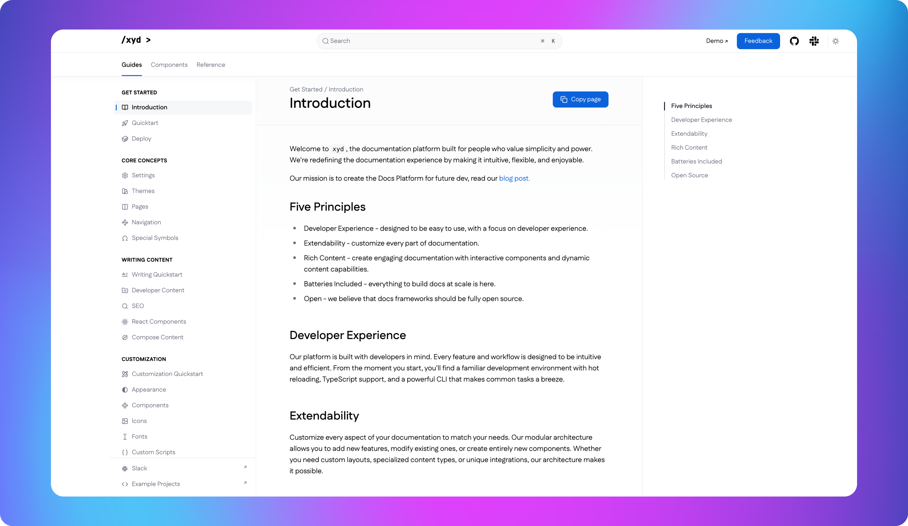

<p align="center">
  <a href="https://xyd.dev">
    <picture>
      <source srcset="assets/readme-logo-dark.svg" media="(prefers-color-scheme: dark)">
      <source srcset="assets/readme-logo.svg" media="(prefers-color-scheme: light)">
      
    </picture>
  </a>
</p>
<p align="center">Docs Framework for future dev.</p>
<p align="center">
  <a href="https://www.npmjs.com/package/xyd-js"></a>
  <a href="https://xyd-docs.slack.com" target="_blank" rel="noopener">
   
  </a>
   <a href="https://github.com/livesession/xyd/discussions">
  
</a>
</p>

<p align="center">
  <a href="https://app.netlify.com/start/deploy?repository=https://github.com/xyd-js/deploy-samples&base=netlify" target="_blank" rel="noopener noreferrer">
    
  </a>
  <a href="https://vercel.com/new/clone?repository-url=https%3A%2F%2Fgithub.com%2Fxyd-js%2Fdeploy-samples%2Ftree%2Fmaster%2Fvercel" target="_blank" rel="noopener noreferrer">
    
  </a>
</p>

<p align="center">
  <a href="https://codesandbox.io/p/github/xyd-js/deploy-samples-codesandbox" target="_blank" rel="noopener noreferrer">
    
  </a>
</p>

[](https://www.youtube.com/watch?v=8FVINsWUgUs)

---

## Quickstart
> [!IMPORTANT]
> Node 22.12+ is required

```bash
# install
bun add -g xyd-js

# run a dev server
xyd 

# build a docs static files
xyd build
```

## Our Philosophy
1. Developer Experience - designed to be easy to use, with a focus on developer experience

2. Extendability - customize every part of documentation

3. Rich Content - create engaging documentation with interactive components and dynamic content capabilities

4. Batteries Included - everything to build docs at scale is here

5. Open - we believe that docs frameworks should be fully open source

## Major Features
- 🎨 **Themes** - Built-in themes: Solar, Gusto, Poetry, Picasso, Opener, and Cosmo
- 🚀 **Plug & Play Dev Server** - Instant development server with hot reload and zero configuration
- ⚙️ **Easy customization** - Extend and modify every component, layout, and functionality
- 📚 **OpenAPI / GraphQL API docs generation** - Automatic documentation generation from API specifications
- 🔌 **Plugins** - Rich ecosystem of plugins for search, analytics, chat, and more
- 📊 **Analytics** - Built-in analytics integration with support for custom events and session replay with LiveSession
- 🧪 **A/B testing** - Built-in integration for A/B testing experiments with LaunchDarkly and GrowthBook
- 🔍 **Full-text search** - Lightning-fast search with typo tolerance and relevance scoring
- 💬 **Live chat** - Seamless integration with Intercom, LiveChat, and Chatwoot
- 💻 **Developer content** - Advanced syntax highlighting with interactive code examples and tooling for developers
- 🔧 **SDK generation capabilities** - Automatic SDK generation from API specifications

## Documentation
For more info [**head over to our docs**](https://xyd.dev/docs).

## Resources
### [Starter](https://github.com/xyd-js/starter)
🚀 The starter for xyd docs

### [Examples](https://github.com/xyd-js/examples)
🚀 Ready-to-run xyd examples

### [Deploy Samples](https://github.com/xyd-js/deploy-samples)
🚀 Ready-to-run xyd deploy samples

### [Storybook](https://components.xyd.dev)
📚 Collection of built-in components.

## FAQ

### How is this different than other Docs Framework?

- 100% open source
- Batteries included - native support for API specs (GraphQL/OpenAPI), SDK generation, Code Languages API docs and more++
- Design System - we built components with [design system](https://components.xyd.dev) philosophy
- Not only docs - xyd is using a couple of in-house packages you can use standalone, e.g a [docs writing engine](https://xwrite.dev) or a set of [tools for modern API docs](https://apitoolchain.dev)

### Why another yet docs framework?
At [LiveSession](https://livesession.io/) we're on our way to creating a next-generation analytics platform.
We need a powerful tool that will meet our needs.
You can [read the story behind it here](https://blog.livesession.dev/why-another-yet-docs-framework).

### How to migrate from my current docs framework to xyd?
First of all, great to hear that! We have a [migration tool](https://xyd.dev/docs/resources/migration-tool) for a bunch of docs frameworks.

## Contributing
### [Development](./DEVELOPMENT.md)
Development guide with setup instructions, available scripts, and contribution guidelines.

---

<div style="display: flex;">
 <p>
   <b>Join our community</b>&nbsp;
 </p>
 <a href="https://xyd-docs.slack.com" target="_blank" rel="noopener">
  
 </a>
  &nbsp;
 <a href="https://github.com/livesession/xyd/discussions">
  
</a>
</div>
